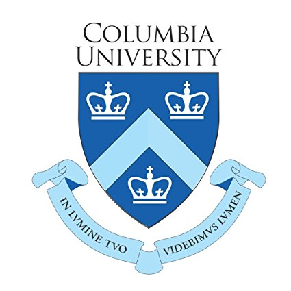
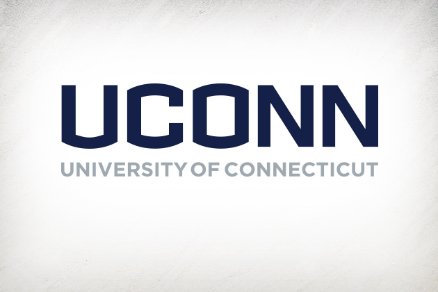

###Education:

####Columbia University Mailman School of Public Health (2017-2019)
MPH Epidemiology (Certificate: Applied Biostatistics)

####University of Connecticut College of Liberal Arts & Sciences (2012-2016)
BS Chemistry (Minor: French)

###Professional Public Health Experiences:

####Columbia University Mailman School of Public Health (Sept. 2018-present)
Graduate Teaching Assistant- The Core

####Columbia Universtiy Medical Center (Sept. 2018-present)
Graduate Research Assistant- Department of Epidemiology & Department of Obstetrics/Gynecology

####NYC Department of Health & Mental Hygiene (June 2018-present)
Epi Scholar- Bureau of Maternal, Infant, & Reproductive Health

####United States Pharmacopeia (May 2017-Aug. 2017)
Health Standards Intern- Global Public Health

####Fair Access Medicines (Oct. 2016-April 2017)
Intern- Public Health

